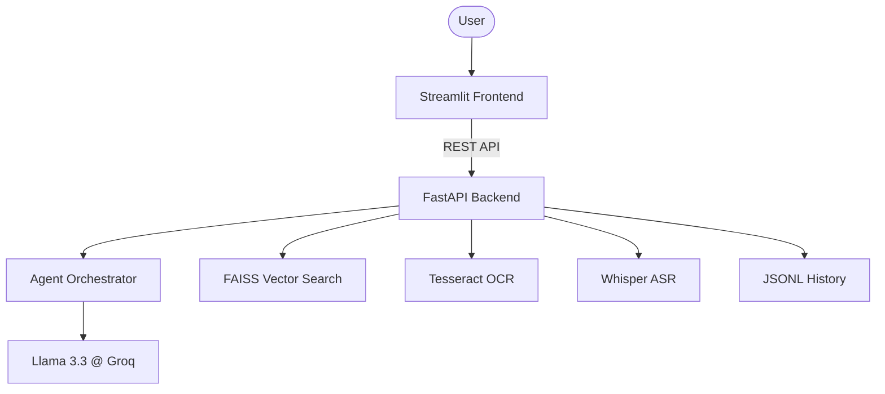

# Math Matrix AI Mentor

An end-to-end AI application for solving JEE-style math problems using a Multi-Agent system, RAG, and Human-in-the-Loop (HITL).


# How to Access
Frontend: http://localhost:8501
Backend Docs: http://localhost:8000/docs

## Features
- **Multimodal Input**: Text, Image (OCR), and Audio (ASR).
- **Multi-Agent Architecture**: 5 specialized agents (Parser, Router, Solver, Verifier, Explainer).
- **RAG Pipeline**: Context-aware solving using a curated math knowledge base.
- **Memory Layer**: Stores interactions and learns from feedback/corrections.
- **HITL Flow**: Triggers human verification for low-confidence OCR or complex problems.
- **Premium UI**: Dark-themed Streamlit dashboard with real-time agent tracing.

## Tech Stack
- **Frontend**: Streamlit
- **Agents**: LangGraph + LangChain + OpenAI GPT-4
- **OCR**: EasyOCR
- **ASR**: OpenAI Whisper
- **Vector DB**: ChromaDB
- **Storage**: SQLite

## Setup Instructions

1. **Clone the repository**:
   ```bash
   git clone <repo-url>
   cd MATAI
   ```

2. **Environment Variables**:
   Create a `.env` file from `.env.example`:
   ```bash
   cp .env.example .env
   # Add your OPENAI_API_KEY
   ```

3. **Install Dependencies**:
   ```bash
   pip install -r requirements.txt
   ```

4. **Initialize Knowledge Base**:
   ```bash
   python init_rag.py
   ```

5. **Run the App**:
   ```bash
   streamlit run app.py
   ```

## 🛠️ Performance Architecture
- **Backend (FastAPI)**: Port 8000. Handles RAG query, Agent execution, and OCR/ASR.
- **Frontend (Streamlit)**: Port 8501. User interface and multimodal uploads.

## Setup Instructions

1. **Environment Variables**:
   Create a `.env` file with `GROQ_API_KEY` and `TESSERACT_PATH`.

2. **Run both components**:
   ```bash
   chmod +x start.sh
   ./start.sh
   ```

3. **Manual Start**:
   - Backend: `uvicorn main:app --reload`
   - Frontend: `streamlit run app.py`

## Architecture

